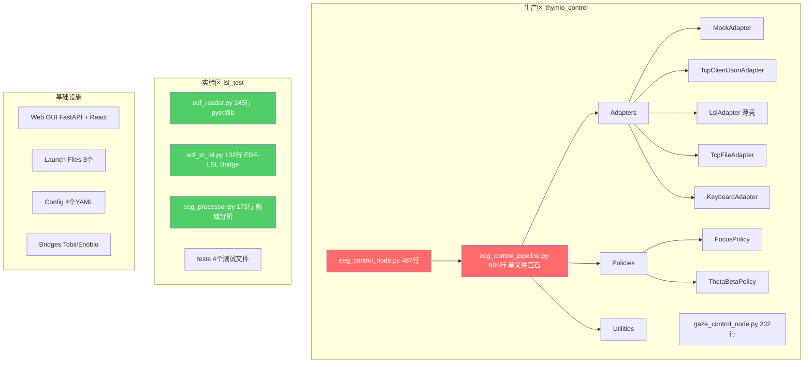
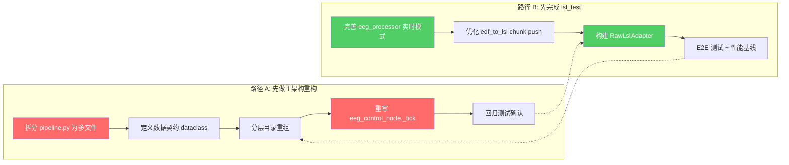

# ROS Thymio 项目深度分析与策略建议

## 1. 项目现状总览

### 1.1 代码地图



### 1.2 各模块成熟度

| 模块 | 文件 | 行数 | 成熟度 | 关键问题 |
|------|------|------|--------|----------|
| EEG Pipeline | `eeg_control_pipeline.py` | 865 | ⚠️ 可用但臃肿 | 单文件巨石，6 种职责混杂 |
| EEG Node | `eeg_control_node.py` | 487 | ⚠️ 可用但复杂 | `_tick()` 方法 ~220 行，3 个控制分支大量重复 |
| Gaze Node | `gaze_control_node.py` | 202 | ✅ 较稳定 | 独立且职责清晰 |
| EDF Reader | `lsl_test/edf_reader.py` | 145 | ✅ 质量好 | API 清晰，有上下文管理器 |
| EDF-LSL Bridge | `lsl_test/edf_to_lsl.py` | 132 | ✅ 基本完成 | 缺少 chunk push 优化 |
| EEG Processor | `lsl_test/eeg_processor.py` | 173 | ✅ 核心价值 | **这是缺失的重计算层** |
| Tests (主链) | `thymio_control/test/` | ~10 文件 | ✅ 覆盖基础场景 | 无性能回归测试 |
| Tests (实验区) | `lsl_test/test_*.py` | 4 文件 | ✅ 较完善 | 依赖真实 EDF 文件 |

---

## 2. 主链架构问题分析

### 2.1 核心问题：`eeg_control_pipeline.py` 是单文件巨石

这个 865 行的文件承担了**至少 6 种不同的职责**：

```
eeg_control_pipeline.py（865 行）
├── 设备配置注册 (EEG_DEVICE_CONFIGS)          → 应属 Device Profile Layer
├── 数据适配器 (5 个 Adapter 类)                → 应属 Transport Layer
├── 协议解析 (parse_sod_packet, extract_tcp_feature) → 应属 Decode Layer
├── 特征计算 (compute_pipeline_feature)          → 应属 Processing Layer
├── 控制策略 (FocusPolicy, ThetaBetaPolicy)      → 应属 Control Layer
└── 主循环 + 配置加载 + 参数解析                  → 应属入口层
```

> [!WARNING]
> 这直接违反了规范 §5 的六层架构模型。任何改动都可能牵连其他层，回归风险高。

### 2.2 `eeg_control_node.py` 的 `_tick()` 方法过度膨胀

`_tick()` 方法约 220 行，包含 3 个几乎相同的控制分支（feature → movement → intents），每个分支都重复了：
- 分析日志发布
- CSV 记录
- verbose 日志
- Twist 发布

这种重复代码使得维护成本极高。

### 2.3 LslAdapter 是"薄壳"，缺少真正的 DSP 处理

当前 `LslAdapter` 只做了：
```
LSL pull_sample → 按索引映射到 metrics dict → 返回 EegFrame
```

它**完全缺少**从 raw EEG 信号到频域特征的处理——即 `lsl_test/eeg_processor.py` 里已经实现的 `compute_band_powers()`。这意味着 LSL 模式在主链中只能接收已经处理好的 feature 数据，不能直接处理 raw EEG。

### 2.4 数据契约未统一

| 问题 | 现状 | 规范要求 |
|------|------|----------|
| RawSampleFrame | 不存在 | 需要 `ts_acquire, source, sample_rate, channel_labels, samples` |
| FeatureFrame | 仅有 EegFrame（metrics dict） | 需要 `ts_feature, source, feature_map` |
| ControlFrame | 仅有 dict | 需要 `ts_control, speed_intent, steer_intent, safety_state` |

### 2.5 现有优势

- **Adapter 模式已成型** — `build_adapter()` 工厂 + 5 种适配器
- **Policy 模式已成型** — `POLICIES` 字典 + 策略接口
- **配置系统基本可用** — YAML 分层 + CLI 覆盖
- **测试基础已有** — 34 个测试覆盖基础场景
- **Web GUI + Launch 系统** — 可用

---

## 3. lsl_test/ 实验区分析

### 3.1 已完成的核心价值

| 文件 | 功能 | 对接主链的价值 |
|------|------|----------------|
| `edf_reader.py` | EDF 文件读取、信号元数据、窗口迭代 | **替代主链缺失的 EDF 回放能力** |
| `edf_to_lsl.py` | EDF-LSL 转发桥接 | **实现 `replay_file + file-lsl` 路径** |
| `eeg_processor.py` | Welch PSD + 5 频段能量提取 | **这是主链完全缺失的重计算层** |

### 3.2 已完成的测试

| 测试文件 | 覆盖内容 | 状态 |
|----------|----------|------|
| `test_edf_reader.py` | Header 解析、信号读取、窗口迭代 | ✅ 6 个测试 |
| `test_edf_to_lsl.py` | Stream 创建、实时/快速回放、E2E | ✅ 6 个测试 |
| `test_offline_analysis.py` | 频段提取、合成信号验证、策略对接 | ✅ 6 个测试 |
| `test_real_time_lsl.py` | LslAdapter 与 EDF-LSL 联合测试 | ✅ 3 个测试 + 1 skip |

### 3.3 缺失 / 需要完善的部分

1. **chunk 批量推送优化** — 当前 `edf_to_lsl.py` 逐样本 `push_sample`，大数据量时效率低，应改为 `push_chunk`
2. **实时窗口滑动处理** — `eeg_processor.py` 支持离线窗口，但缺少适合实时流的**滑动窗口 + 增量 PSD** 模式
3. **合并到主链的适配层** — 需要一个 `RawLslAdapter`（拉取 raw 样本 → 累积窗口 → 调用 `compute_band_powers` → 输出 EegFrame）

---

## 4. 两条路径的依赖分析



### 关键依赖点
- **路径 A → B**：如果先重构架构，`lsl_test` 的代码合并目标会变（目录/接口都变了），导致重复工作
- **路径 B → A**：如果先完成 `lsl_test`，可以**带着验证过的核心算法**进入架构重构，减少算法层的不确定性

---

## 5. 建议：先完成 lsl_test，再做主架构重构

> [!IMPORTANT]
> **推荐执行顺序：B（lsl_test）→ A（架构重构）**

### 5.1 理由

| 维度 | 先做 lsl_test (推荐) | 先做架构重构 |
|------|---------------------|-------------|
| **风险** | ✅ 低 — 实验区改动不影响主链运行 | ⚠️ 高 — 大面积重构可能引入回归 |
| **产出可见性** | ✅ 快速看到 EDF-LSL-特征 的完整链路 | ❌ 架构改动不会产生新功能 |
| **对架构重构的帮助** | ✅ 验证过的算法模块直接填充到新架构的 Processing Layer | ❌ 空的 Processing Layer 等待填充 |
| **合并冲突** | ✅ 合并时目标架构已经确定，一次到位 | ⚠️ 架构重构后再合并，可能又要调接口 |
| **测试基线** | ✅ lsl_test 的测试成为架构重构的回归保障 | ❌ 缺少算法层的测试基线 |

### 5.2 具体执行计划

#### Phase B: 完成 lsl_test（预计 2-3 个工作日）

```
B.1 [完善 eeg_processor.py]
    - 添加 StreamingBandPowerExtractor（滑动窗口 + 增量 PSD）
    - 支持可配置的 window_sec / hop_sec
    - 单元测试
    
B.2 [优化 edf_to_lsl.py]
    - push_chunk 批量推送
    - 可配置的 chunk_size
    - 性能测试

B.3 [构建 RawLslAdapter]
    - pull_chunk → 累积到窗口 → compute_band_powers → EegFrame
    - 支持 window_sec / hop_sec 配置
    - 与现有 LslAdapter 共存（feature flag）

B.4 [E2E 测试 + 延迟基线]
    - EDF → LSL → RawLslAdapter → FocusPolicy → speed_intent
    - 采集 p50/p95 延迟数据
```

#### Phase A: 主架构重构（预计 3-5 个工作日）

```
A.1 [数据契约落地]
    - RawSampleFrame / FeatureFrame / ControlFrame dataclass
    - 所有 Adapter 输出归一化到契约

A.2 [拆分 eeg_control_pipeline.py]
    thymio_control/thymio_control/
    ├── contracts.py          # 数据契约
    ├── device_profiles.py    # 设备注册表
    ├── adapters/
    │   ├── base.py
    │   ├── mock.py
    │   ├── tcp_client.py
    │   ├── lsl_raw.py        # ← 从 lsl_test 合并
    │   ├── lsl_feature.py    # ← 现有 LslAdapter
    │   └── tcp_file.py
    ├── processors/
    │   ├── band_power.py     # ← 从 lsl_test 合并
    │   └── enrich.py
    ├── policies/
    │   ├── base.py
    │   ├── focus.py
    │   └── theta_beta.py
    └── pipeline.py           # 薄入口，组装各层

A.3 [重写 eeg_control_node._tick()]
    - 抽取公共控制逻辑，消除 3 个分支的重复代码
    - 分离日志/CSV/分析发布为独立方法

A.4 [回归测试 + 性能回归]
    - 现有 34 个测试 + lsl_test 21 个测试全绿
    - 延迟指标不劣于 Phase B 基线
```

---

## 6. 待确认的问题

> [!IMPORTANT]
> 请确认以下几点，以便我开始执行：

1. **你同意先执行 Phase B（lsl_test）吗？** 还是你有不同的优先级考虑？

2. **lsl_test 的算法参数是否已经调优？** `eeg_processor.py` 里的 Welch 参数（nperseg=256, noverlap=128）和频段定义（如 alpha 8-13 Hz）是否是你实验确认过的？还是需要进一步调整？

3. **实时处理的窗口参数偏好？** 当前离线用 `window_sec=1.0, step_sec=0.5`，实时也用这组参数吗？还是需要更低延迟（如 `window_sec=0.5, step_sec=0.25`）？

4. **Phase A 重构时，是否保留 `eeg_control_pipeline.py` 作为兼容入口？** 规范中提到"可回滚"，我建议保留旧文件一段时间作为 fallback。
